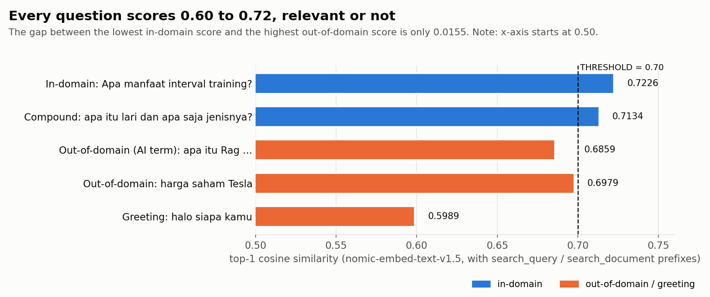

# RAG Lokal dengan LLM Open Source

[English](README.md)

Pipeline RAG yang berjalan sepenuhnya di GPU Colab. Jawaban dibuat oleh model Llama 3.1 8B yang di-fine-tune untuk bahasa Indonesia, sedangkan retrieval memakai nomic-embed-text-v1.5. Notebook ini lalu mengujinya dengan lima kategori pertanyaan, dengan dan tanpa similarity threshold, untuk melihat di bagian mana model kecil yang dikuantisasi mulai keliru.

## Konfigurasi

| Bagian | Pilihan |
|---|---|
| LLM | [`rubythalib33/llama3_1_8b_finetuned_bahasa_indonesia`](https://huggingface.co/rubythalib33/llama3_1_8b_finetuned_bahasa_indonesia), `unsloth.Q4_K_M.gguf` |
| Embedding | [`nomic-ai/nomic-embed-text-v1.5-GGUF`](https://huggingface.co/nomic-ai/nomic-embed-text-v1.5-GGUF), Q4_K_M, 768 dimensi |
| Runtime | llama-cpp-python 0.3.35 dengan build CUDA, semua layer di GPU, `n_ctx=4096` |
| Prompt | raw completion dengan format Alpaca, sesuai format fine-tune model |
| Retrieval | cosine similarity terhadap 20 dokumen pendek tentang olahraga lari, top-3 |

Ada empat detail yang dampaknya lebih besar dari kelihatannya:

- **Build CUDA.** `pip install llama-cpp-python` biasa menghasilkan build khusus CPU, dan `n_gpu_layers=-1` lalu diabaikan tanpa error sama sekali. Notebook ini mengecek `llama_supports_gpu_offload()` dan berhenti kalau hasilnya `False`.
- **`n_ctx`.** Kalau tidak diset, konteksnya hanya 512 token, dan prompt RAG ditambah jawaban 256 token saja sudah bisa melebihinya.
- **Prefix task.** nomic-embed membutuhkan `search_document: ` untuk teks yang disimpan dan `search_query: ` untuk pertanyaan.
- **Format prompt.** GGUF ini tidak membawa chat template, sehingga `create_chat_completion` jatuh ke format Llama 2. Karena itu notebook memanggil model sebagai raw completion dengan template Alpaca.

## Hasil

Semua angka berasal dari notebook yang sudah dijalankan di GPU NVIDIA RTX PRO 6000 Blackwell di Colab.

### Tanpa threshold

| Kategori | Pertanyaan | Jawaban |
|---|---|---|
| Dalam domain | Apa manfaat interval training? | Benar: meningkatkan kecepatan dan kapasitas VO2 max |
| Majemuk | apa itu lari dan apa saja jenis-jenisnya? | Menyebut jenis-jenis lari, padahal dokumen tentang jenis lari **tidak** terambil |
| Luar domain (istilah AI) | apa itu Rag dan bagaimana cara kerjanya | **"Rag adalah istirahat dan hari tanpa latihan..."** (halusinasi) |
| Luar domain | Berapa harga saham Tesla hari ini? | Menolak |
| Sapaan | halo siapa kamu | Menolak |

### Dengan `THRESHOLD = 0.70`

| Kategori | LLM dipanggil | Jawaban |
|---|---|---|
| Dalam domain | ya (1 chunk) | Benar |
| Majemuk | ya (3 chunk) | Masalah yang sama seperti di atas |
| Luar domain (istilah AI) | **tidak** | Menolak |
| Luar domain | **tidak** | Menolak |
| Sapaan | **tidak** | Menolak |

Kecepatan generasi berada di kisaran 112 sampai 182 token per detik, termasuk evaluasi prompt. Latensi per pertanyaan 0,09 sampai 0,49 detik.

## Yang saya pelajari

- **Pertanyaan yang berbahaya justru istilah yang asing, bukan topik yang jelas tidak berhubungan.** Model menolak sendiri pertanyaan harga saham dan sapaan, tapi kata "Rag" yang tidak dikenal ditempelkan ke chunk yang terambil pertama, lalu dijawab dengan yakin.
- **Instruksi di prompt saja tidak cukup.** Prompt sudah meminta model menjawab dengan kalimat penolakan tertentu kalau jawabannya tidak ada di konteks, tapi halusinasi tetap terjadi.
- **Threshold yang menghentikannya, tapi dengan selisih tipis.** Semua pertanyaan mendapat skor 0,60 sampai 0,72. Skor dalam domain terendah (0,7134) dan skor luar domain tertinggi (0,6979) hanya berjarak 0,0155, jadi 0,70 berhasil untuk lima pertanyaan ini tapi belum tentu untuk pertanyaan berikutnya.
- **Threshold tidak memperbaiki retrieval yang meleset.** Pertanyaan majemuk lolos threshold, tapi chunk yang dibutuhkan tidak masuk top-3, dan model mengisi kekosongannya dari pengetahuannya sendiri.

## Keterbatasan

- Lima pertanyaan uji cukup untuk menunjukkan pola kegagalan, tapi belum cukup untuk mengukur tingkat halusinasi.
- Threshold 0,70 berada di celah yang sangat sempit dan dipilih dari lima pertanyaan yang sama.
- GPU yang dipakai jauh lebih besar dari T4 yang umum tersedia di Colab gratis, jadi kecepatan di GPU yang lebih kecil akan lebih rendah.

## Cara menjalankan

1. Buka `rag_open_source_llm_local.ipynb` di Google Colab dengan runtime GPU.
2. Jalankan sel install (build llama-cpp-python dengan CUDA bisa memakan waktu 10 sampai 20 menit).
3. Jalankan evaluasi tanpa threshold lebih dulu, lihat kolom `top_score`, lalu isi `THRESHOLD` dan lanjutkan.
4. Hasilnya disimpan ke `hasil_rag_lokal.csv`.

## Teknologi

llama-cpp-python (CUDA) · Llama 3.1 8B fine-tune bahasa Indonesia (GGUF) · nomic-embed-text-v1.5 (GGUF) · NumPy · pandas · Google Colab

## Lisensi

[MIT](LICENSE)
